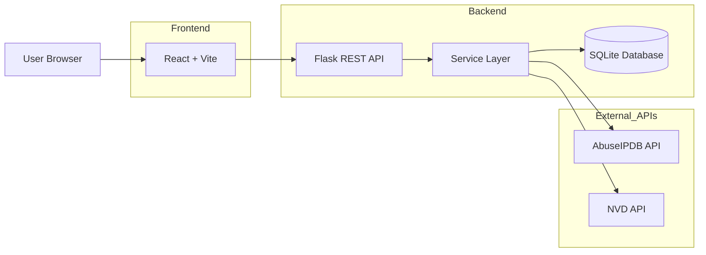
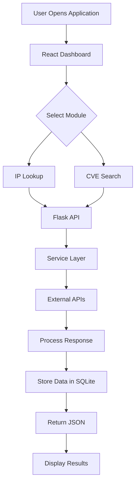
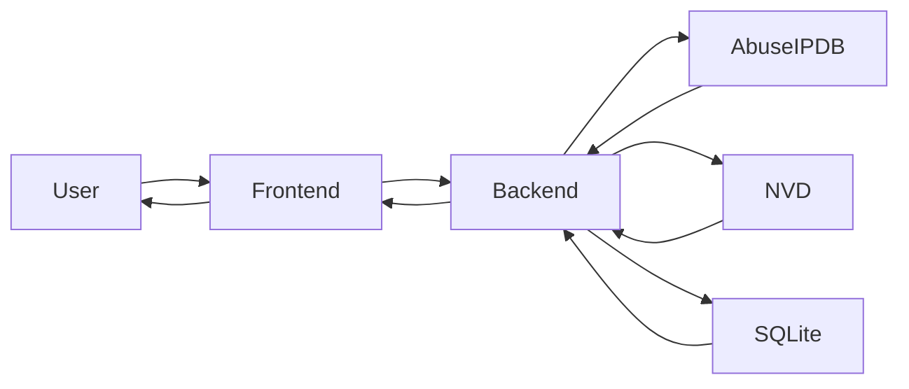

# 🛡️ Threat Intelligence Aggregator


A full-stack cybersecurity web application that aggregates threat intelligence from multiple trusted security sources into a single, user-friendly dashboard. The application enables security analysts, students, and cybersecurity enthusiasts to investigate suspicious IP addresses, explore the latest Common Vulnerabilities and Exposures (CVEs), and visualize cybersecurity trends through an intuitive interface.

---

## 🚀 Features

### 📊 Dashboard

* Real-time cybersecurity overview
* Interactive charts and visualizations
* Threat statistics at a glance
* Clean and responsive interface

### 🌐 IP Intelligence

* IP reputation lookup
* Abuse confidence score
* Country and ISP information
* Usage type and reputation details

### 🛡️ Vulnerability Intelligence

* Latest CVE search
* CVSS severity score
* Vulnerability descriptions
* Published and last updated dates

### ⚡ User Experience

* Fast REST API
* Responsive design
* User-friendly error handling
* Smooth navigation
* Modern UI

---

## 💡 Why This Project?

Threat intelligence is often distributed across multiple platforms, requiring analysts to switch between different services to gather relevant information. This project simplifies the investigation process by combining trusted cybersecurity data sources into a single dashboard, making vulnerability research and IP reputation analysis faster, easier, and more efficient.

---

## ⭐ Key Highlights

* Full Stack Cybersecurity Project
* REST API Architecture
* Flask Backend
* React Frontend
* SQLite Database
* Third-party API Integration
* Interactive Charts
* Responsive Design
* Portfolio Ready

---

## 🏗️ Tech Stack

### Frontend

* React
* Vite
* Axios
* Chart.js
* React Icons
* CSS3

### Backend

* Python
* Flask
* Flask-CORS
* SQLAlchemy

### Database

* SQLite

### APIs Used

* National Vulnerability Database (NVD)
* AbuseIPDB

---

## 🏛️ Architecture

## 🏛️ System Architecture



## 🔄 Application Workflow



## 📊 Data Flow



---

## 📁 Project Structure

```text
Threat-Intelligence-Aggregator
│
├── backend
│   ├── routes
│   ├── services
│   ├── instance
│   ├── app.py
│   ├── config.py
│   ├── database.py
│   ├── models.py
│   └── requirements.txt
│
├── frontend
│   ├── src
│   │   ├── assets
│   │   ├── components
│   │   ├── pages
│   │   ├── services
│   │   ├── styles
│   │   ├── App.jsx
│   │   └── main.jsx
│   ├── package.json
│   └── vite.config.js
│
├── screenshots
├── docs
├── README.md
└── .gitignore
```
---

## ⚙️ Installation

### Clone the Repository

```bash
git clone <repository-url>
cd Threat-Intelligence-Aggregator
```

### Backend Setup

```bash
cd backend

python -m venv venv

# Windows
venv\Scripts\activate

# macOS/Linux
source venv/bin/activate

pip install -r requirements.txt

python app.py
```

### Frontend Setup

```bash
cd frontend

npm install

npm run dev
```

The application will be available at:

* Frontend: `http://localhost:5173`
* Backend: `http://localhost:5000`

---

## 🔑 Environment Variables

Create a `.env` file inside the `backend` directory.

```env
NVD_API_KEY=YOUR_NVD_API_KEY
ABUSEIPDB_API_KEY=YOUR_ABUSEIPDB_API_KEY
```

---

## 🌐 API Endpoints

| Method | Endpoint         | Description                     |
| ------ | ---------------- | ------------------------------- |
| GET    | `/api/dashboard` | Retrieve dashboard statistics   |
| GET    | `/api/ip`        | Perform IP reputation lookup    |
| GET    | `/api/cve`       | Retrieve latest CVE information |

---

## 📸 Screenshots

Project screenshots will be added after deployment.

* Dashboard
* IP Reputation Lookup
* CVE Search
* Analytics & Charts
* Responsive UI

---

## 🌍 Live Demo

Deployment links will be added after hosting.

* Frontend: Coming Soon
* Backend API: Coming Soon

---

## 🔮 Future Enhancements

* IOC (Indicators of Compromise) Search
* Threat Feed Aggregation
* PDF Report Generation
* CSV Export
* Email Notifications
* User Authentication
* Threat History Tracking
* Advanced Search Filters
* Dark Mode
* Docker Deployment
* Threat Intelligence Feed Integration
* Performance Optimization

---

## 👨‍💻 Author

**Siddhant Uniyal**

Bachelor of Engineering (Computer Science)

Chandigarh University

---

## 📄 License

This project is created for educational, learning, and portfolio purposes.

Feel free to fork, modify, and extend the project for personal or educational use.


## 📌 Project Highlights

- ✅ Full-Stack Cybersecurity Application
- ✅ RESTful API Architecture
- ✅ Modular Flask Backend
- ✅ Responsive React Frontend
- ✅ SQLite Database Integration
- ✅ Third-Party Threat Intelligence APIs
- ✅ Interactive Charts & Dashboard
- ✅ Professional GitHub Documentation
- ✅ Portfolio-Ready Project

## 🧠 Skills Demonstrated

- Python
- Flask
- REST API Development
- React.js
- Vite
- SQLAlchemy
- SQLite
- API Integration
- JSON Processing
- Cybersecurity Fundamentals
- Threat Intelligence
- Data Visualization
- Responsive Web Design
- Git & GitHub

## 📈 Project Statistics

| Category              | Details            |
| --------------------- | ------------------ |
| Frontend              | React + Vite       |
| Backend               | Flask              |
| Database              | SQLite             |
| APIs Used             | 2                  |
| Programming Languages | Python, JavaScript |
| REST Endpoints        | 3+                 |
| Charts                | Yes                |
| Responsive Design     | Yes                |
| GitHub Ready          | ✅                  |

## 🎯 Learning Outcomes

Through this project, I strengthened my understanding of:

* Building full-stack web applications using React and Flask
* Designing and consuming RESTful APIs
* Integrating third-party cybersecurity APIs
* Managing data with SQLite and SQLAlchemy
* Structuring scalable frontend and backend codebases
* Creating responsive user interfaces
* Handling API errors and asynchronous requests
* Presenting technical projects with professional documentation


